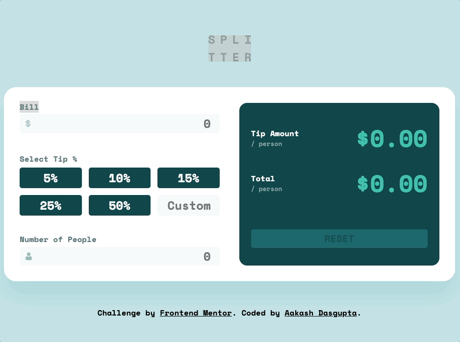

# Frontend Mentor - Tip calculator app solution

This is a solution to the [Tip calculator app challenge on Frontend Mentor](https://www.frontendmentor.io/challenges/tip-calculator-app-ugJNGbJUX).

## Table of contents

- [Overview](#overview)
  - [The challenge](#the-challenge)
  - [Screenshot](#screenshot)
  - [Links](#links)
- [My process](#my-process)
  - [Built with](#built-with)
  - [What I learned](#what-i-learned)
  - [Continued development](#continued-development)
  - [Useful resources](#useful-resources)
- [Author](#author)
- [Acknowledgments](#acknowledgments)

## Overview

### The challenge

Users should be able to:

- View the optimal layout for the app depending on their device's screen size
- See hover states for all interactive elements on the page
- Calculate the correct tip and total cost of the bill per person

### Screenshot


### Links

- Solution URL: [Link](https://github.com/a-d14/tip-calculator-frontend-mentor)
- Live Site URL: [Link](https://a-d14.github.io/tip-calculator-frontend-mentor)

## My process

### Built with

- Semantic HTML5 markup
- SASS
- 7-1 Architecture
- Flexbox
- Mobile-first workflow
- Vanilla JS

### What I learned
During this project I learned how to set widths for flex items when there is a ```gap``` property. I have put the formula below

```
width: calc(100% / var(--number-of-items) - (var(--gap) * var(--number-of-gaps) / var(--number-of-items)));
```

## Author
- Frontend Mentor - [@a-d14](https://www.frontendmentor.io/profile/a-d14)
